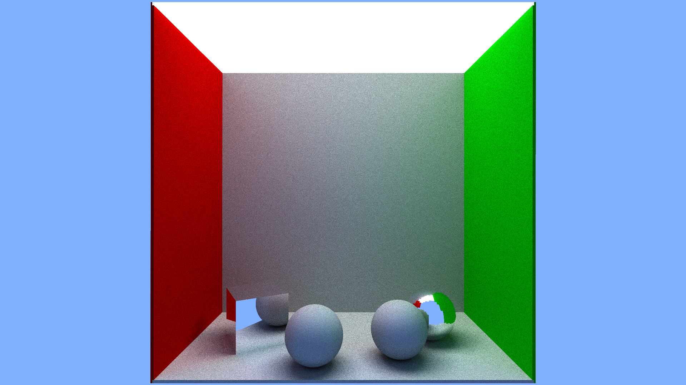
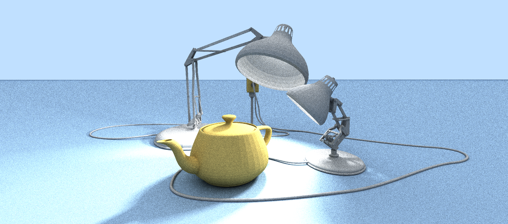
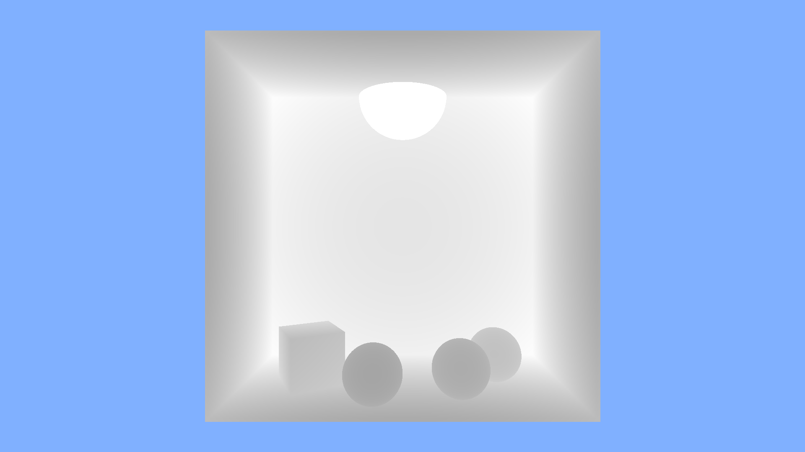
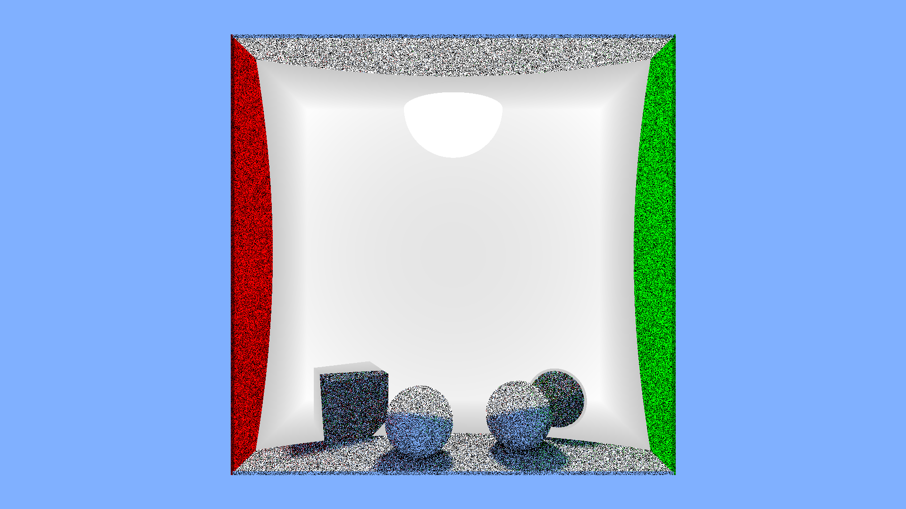
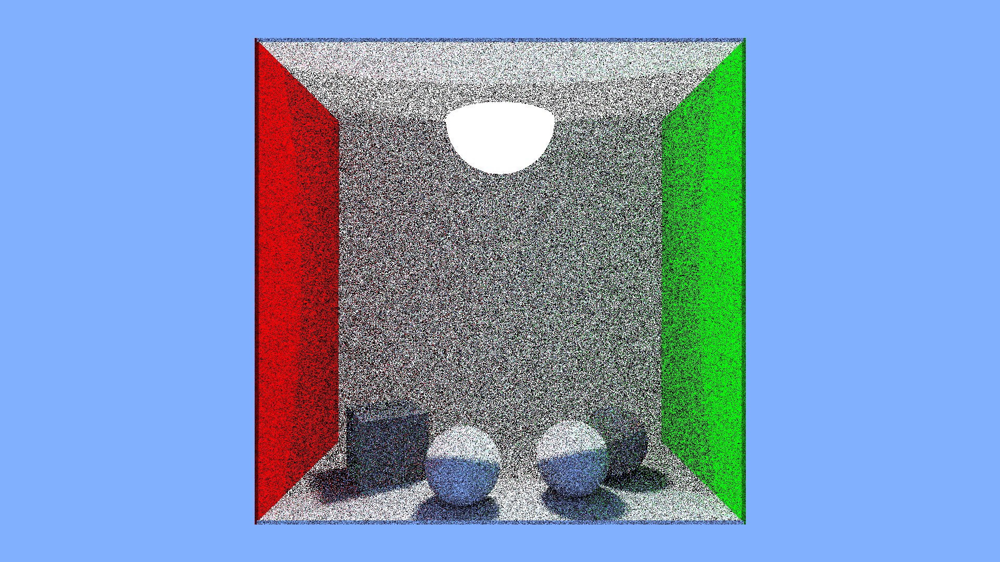

# MonteRay - A [Three.js](https://threejs.org/) pathtracing renderer

Written in 100% ES5 JavaScript using native Three.js classes and objects. This renderer has been created as an alternative to the default Three.js WebGL renderer, and will (at some future time) support most if not all Three.js scenes and materials.

[Examples](#examples) — [API Reference](https://github.com/TechLabsInc/MonteRay/wiki/API-Reference)



*Tested on Three.js r112, r113, r120dev, r123 and r128.*

**NOTE: MeshBVH accelerated raycasting is only supported on Three.js r123 and later.**

### Features include:

 * 100% JavaScript (0% GLSL = no WebGL required!)
 * Progressive rendering
 * Physically accurate rendering using Monte Carlo methods
 * Russian roulette path termination
 * Soft shadows
 * Global Illumination
 * Lighting using emissive meshes instead of abstract lights
 * Background environment lighting
 * BVH Accelerated raycasting via [gkjohnson](https://github.com/gkjohnson)'s [MeshBVHLib](https://github.com/gkjohnson/three-mesh-bvh)
 * Explicit light sampling
 * Closest-first rendering
 * ... More features coming soon!

&nbsp;

# Examples



 - [Luxo Jr](https://techlabsinc.github.io/MonteRay/Examples/Luxo.html)
 - [Lighting McQueen](https://techlabsinc.github.io/MonteRay/Examples/McQueen.html)
 - [Cornell Box](https://techlabsinc.github.io/MonteRay/Examples/CornellBox.html)

&nbsp;

# Usage

**NOTE: MonteRay is in the alpha development stage right now.**

## Installation

Make sure you include the following dependencies:
 - [three.js](https://github.com/mrdoob/three.js)
 - [three.js MeshSurfaceSampler](https://github.com/mrdoob/three.js/blob/dev/examples/jsm/math/MeshSurfaceSampler.js)
 - [three-mesh-bvh](https://github.com/gkjohnson/three-mesh-bvh) **optional*

Download the [latest build of MonteRay](https://raw.githubusercontent.com/TechLabsInc/MonteRay/master/Build/MonteRay.min.js), and include it as an HTML script:

```html
<script src="MonteRay.js"></script>
```

And it is ready to use in your Three.js project:

```javascript
var renderer = new MonteRay.PathtracingRenderer(options);
```

Or import as a module:

```javascript
import { PathtracingRenderer } from "./MonteRay.module.js";

var renderer = new PathtracingRenderer(options);
```

## Renderer options
see [API Reference](https://github.com/TechLabsInc/MonteRay/wiki/API-Reference)


&nbsp;

**NOTE: Make sure to include emissive materials in your scene as regular Three.js lights (AmbientLight, HemisphereLight, DirectionalLight, PointLight and SpotLight) don't work.**

### Supported material types

 * Diffuse
 * Mirror
 * Refractive
 * ... Other materials coming soon!

`MonteRay.CustomMaterial` (allowing for volumetric meshes like water, fog and clouds) coming soon!

**NOTE: `THREE.ShaderMaterial` and `THREE.RawShaderMaterial` will not be implemented for the sake of not using WebGL.**

&nbsp;

# Introduction

In early 2021, I was looking for a photorealistic renderer for Three.js (I decided to use Three.js because of the extensive work done to support many 3D model file formats). I came across many different options including [erichlof](https://github.com/erichlof)'s [THREE.js-PathTracing-Renderer](https://github.com/erichlof/THREE.js-PathTracing-Renderer) and [hoverinc](https://github.com/hoverinc)'s [Ray Tracing Renderer](https://github.com/hoverinc/ray-tracing-renderer). Having no (real) experience in computer graphics, I decided to try to implement them in my projects. After reading through the code (and trying to understand as much as I could from GLSL) I realized that none of these were going to give me the compatibility and integration with Three.js I was looking for.

Needless to say, I decided to take it upon myself to create a fully-functional Three.js path-tracing renderer that uses:

 1. Monte Carlo path tracing methods for most accurate results
 2. Native Three.js Meshes
 3. Emissive meshes as lights instead of default Three.js lights for soft shadows and projectors
 4. Native Three.js raycasters to allow much easier BVH acceleration (and mainly to make it easier for myself since this is my first try at path tracing)
 5. Native Three.js colors for automatic clamping and color equations
 6. No GLSL!

(basically as integrated with Three.js as possible)

I spent weeks learning path tracing and the best practices for path tracing, and finally–after no less than 467 failed test renders, reading through the source code of every path tracer and pdf I could find on the internet (including [montelight-cpp](https://github.com/Smerity/montelight-cpp) by [Smerity](https://github.com/Smerity))–I came up with something acceptable to publish on github.

&nbsp;

# How it Works

In this project, I use a variety of methods to improve accuracy and speed of traditional Monte Carlo path tracing.

MonteRay divides the rendering process into two phases:

 1. Pre-rendering
 2. Rendering

## Pre-rendering Phase

During the pre-rendering phase MonteRay analyzes the scene computing the BVH trees of all meshes and registering meshes with emissive materials for explicit lighting, then writes the depth data to the screen as a placeholder



and orders the pixels by depth to allow for closest-first rendering.



## Rendering Phase

During the rendering phase MonteRay backward traces each path and averages the samples as a typical path tracer would, and displays the data to the screen after a specified interval of rendered pixels, and stops after a specified number of samples per pixel.



&nbsp;

# TODO
 - [ ] Texture maps
   - [ ] Diffuse
   - [ ] Emissive
   - [ ] Roughness
   - [ ] Normal
   - [ ] Bump
   - [ ] Displacement
 - [ ] HDRI (and EXR) Environments
 - [ ] Background emissive maps and background intensity
 - [ ] Standard materials
   - [x] Diffuse
   - [x] Specular (Mirror)
   - [ ] Clearcoat (Glossy)
   - [x] Refractive **partial support*
 - [x] Antialiasing **partial support*
 - [ ] Noise reduction (through variance reduction or simple denoising)
 - [ ] Instancing (`THREE.InstancedMesh`)
 - [ ] Multi-thread support via Web Worker API
 - [ ] Smooth shading
